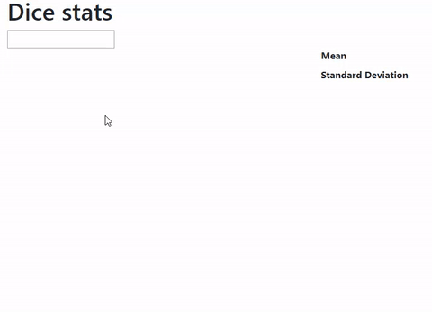
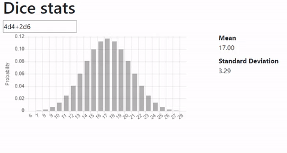

# DiceStats
A tool to visualize probability distribution and other info about dice rolls.
[Hosted here on GitHub pages](https://asparagii.github.io/dice-stats/).

## How to use
Just type in the input field a roll expression, such as `10d4+2d6-4` and the distribution will be displayed, along with info such as mean and standard deviation.

If you hover your mouse on the chart, `P(X < i)` will be displayed, where `i` is the value hovered.

## How to build
`npm install` - Install dependencies

`npm run build` - Pack everything with webpack

Then open `index.html` with a web browser.
